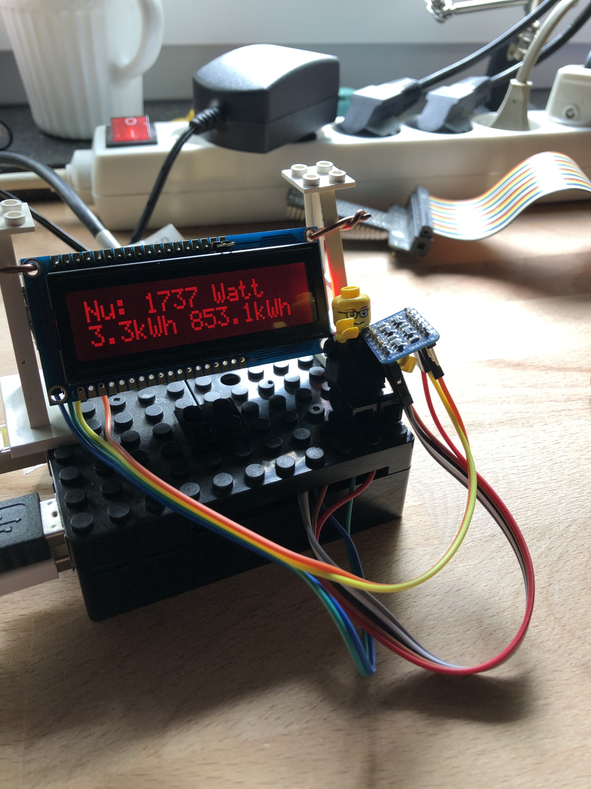

# omnik-monitor
Stealing the data of my own Omnik inverter by 'parsing' the data of /js/status.js. 
Showing the data on a Raspberry Pi with attached i2c LCD panel (pretty 101).
Thanks to Steve Jobs for holding the level shifter.

